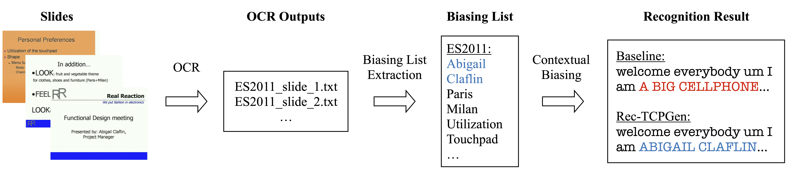

# Biasing List Extraction for AMI Slides

<!-- PIPELINE -->
 

  
  <h3 align="center">Visual-grounded Contextual ASR Pipeline</h3>
  

### Contents:

`OCR_raw` Raw OCR text files obtained using [Tesseract toolkit](https://github.com/tesseract-ocr/tesseract)

`Biasing_list/` Directory containing biasing lists for each meeting series. Meetings series are represented using the common prefix, e.g. the ES2011 biasing list is for ES2011a-ES2011d, and IB40 biasing list is used for IB4001, IB4002, IB4003, IB4004, IB4010, IB4011. 

`select_slides_words.py` Python script selecting words from the slides that are in the `full_rare_word_list.txt`. It generates `meeting_KB.json` and files in `Biasing_list/` for each meeting series.
